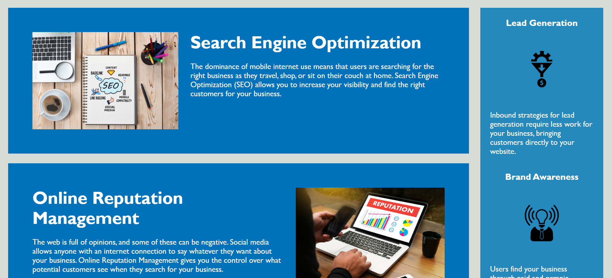

# Marketing-agency-website

## Deployed link
* [Marking Website](https://md7113.github.io/Marketing-agency-website/)

## site picture




## Technologies Used
- HTML : Used to format the content of the page
- CSS : Used to style the HTML on the web browser
- Git : Used to version control the code during the creation process
- GitHub : hosting the repositroy responsible for the website

## Authors
- Unnamed original programer
- Edited by Mason Davis

## summary
This repository contains the code responsible for the website of the Marketing agency Horiseon. It also holds all the images and subsiquent formatting. Though this repository is home to this code it did not orginate here, the credit for this code goes to an unnammed programmer. Everything done to the code was only to edit the formating no functionallity was changed.

## Code Snippet
```html
<nav>
    <ul>
        <li>
            <a href="#search-engine-optimization">Search Engine Optimization</a>
        </li>
        <li>
           <a href="#online-reputation-management">Online Reputation Management</a>
        </li>
        <li>
            <a href="#social-media-marketing">Social Media Marketing</a>
        </li>
    </ul>
</nav>
```


## Author links
[LinkedIn](https://www.linkedin.com/in/davis-mason-t/)
[GitHub](https://github.com/Md7113)